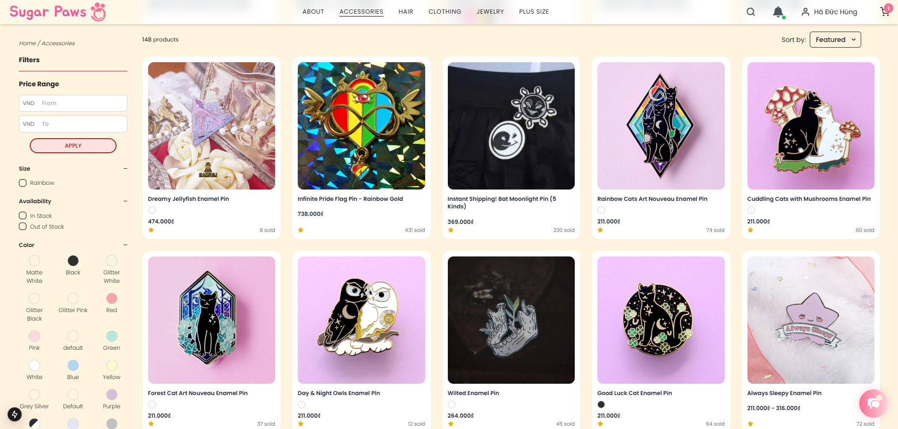
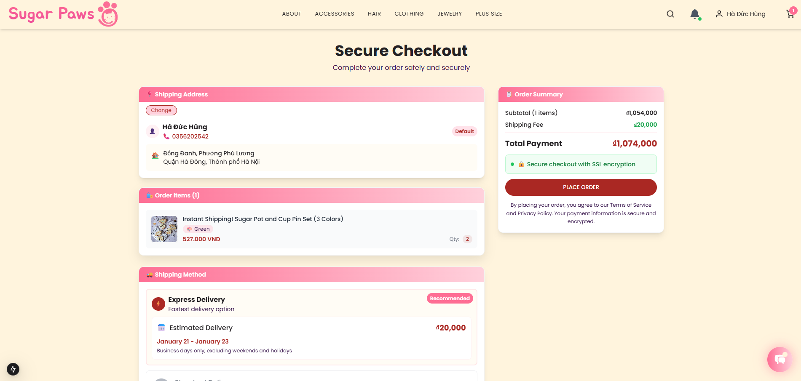
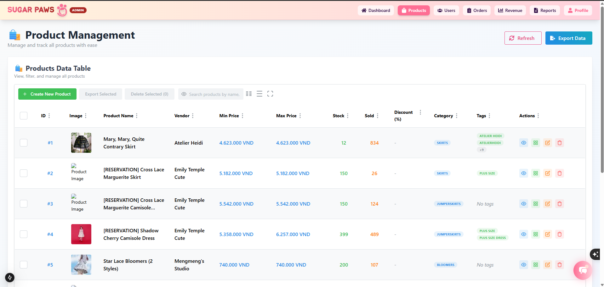
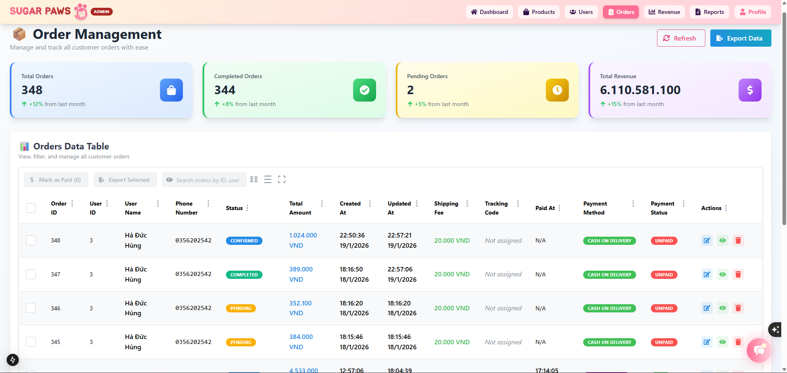
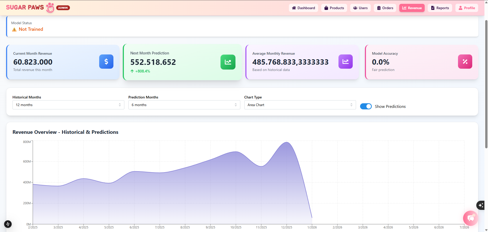
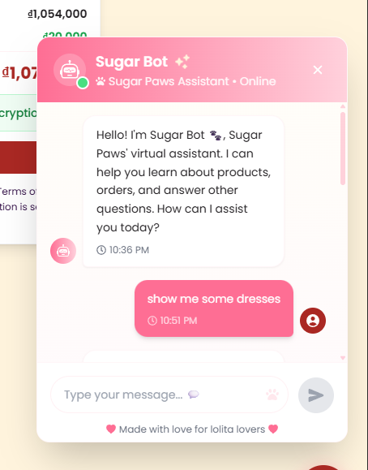

### Phát triển hệ thống thương mại điện tử SugarPaw theo mô hình tập trung Monolithic

- Dự án đã có migration, seed data nên em nghĩ file .sql là không cần thiết cũng có thể run dự án bình thường ạ.
  Hoặc thầy có thể import file .sql cũng được ạ.

- Cài đặt VS Code (màu xanh dương).
- Giải nén file zip sẽ nhận được 2 folder code là: SUGAR_PAW_FE và SUGAR_PAW_BE.
- Bật VS Code và mở 2 folder trên ở 2 tab.
- Đảm bảo rằng máy đã có cài đặt npm và đã cài đặt docker
- Trước hết đối với tab BE:
  - Bật terminal ở VS code
  - Dự án yêu cầu phiên bản npm (11.6.2) -> chạy 'npm install -g npm@11.6.2'
  - Sau đó chạy 'npm i'.
  - Mở docker desktop -> chạy 'docker compose up -d' trên terminal. Sau khi docker pull image và thấy các service start thì
    DB và Redis server đã được khởi tạo.
  - Chạy lệnh 'npx prisma generate' sau đó 'npx prisma migrate deploy' sau đó 'npm run seed'.
  - Chạy lệnh 'npm run start' để chạy dự án.
  - Khi terminal hiển thị ' Application is running on: http://[::1]:5080' -> BE đã run thành công.
- Đối với tab FE:
  - Mở terminal chạy lệnh 'npm i'
  - Khi thấy dòng ' - Local: http://localhost:3000' -> FE đã run thành công.
  - Mới đầu khi run thì dự án build hơn chậm do nextjs build khá lâu. Thầy đợi 1 chút hoặc reload giúp em ạ.

- Về cấu trúc thư mục ở BE:

* Sẽ chia thành các modules, mỗi module sẽ là 1 chức năng chính của dự án, bao gồm (controller, service, modal,...)
* Thư mục common bao gồm các enum, type sẽ dùng chung ở toàn bộ dự án.
* Thư mục auth sẽ chứa các controller, service, decorator, strategy phục vụ chức năng xác thực và phân quyền.
* Package.json sẽ là nơi các dependency của dự án sử dụng.

- Về cấu trúc thư mục ở FE:

* Folder 'public' sẽ chứa các static file như: icon, images,...
* Code chính sẽ nằm trong src.
* 'Api' folder: Nơi chứa các service phục vụ việc call api xuống BE.
* 'App' folder: Các giao diện chính của sản phẩm sẽ được định nghĩa ở đây -> đây cũng là nơi next-router được định nghĩa.
* 'Component' folder: Chứa các component phụ trong dự án.
* 'Const, helper, hook, lib, store': Là nơi định nghĩa các function dùng common, type, context.
* Package.json sẽ là nơi các dependency của dự án sử dụng.

Luồng chạy của dự án: Client call api -> đi qua interceptor (auth) để xác thực và phân quyền -> endpoint trong controller tương ứng
-> service xử lý logic cũng như với DB thông qua Repository -> Trả về kết quả tương ứng cho client.

Tài khoản mặc định: username: alice123, password: 123456
Bên admin thầy chỉ cần thêm endpoint '/admin'

File .env của BE và FE em đưa vào folder zip để bảo mật ạ.

## Screenshots

### Trang chủ

### Trang sản phẩm

### Trang đơn hàng

### Quản lý sản phẩm (Admin)

### Quản lý đơn hàng (Admin)

### Thống kê (Admin)

### Chatbot

